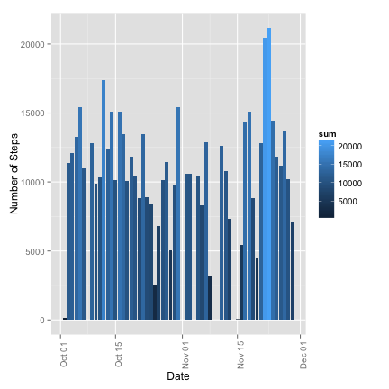
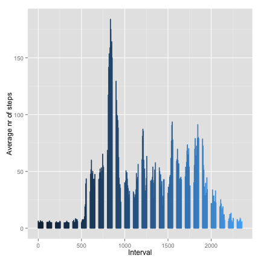
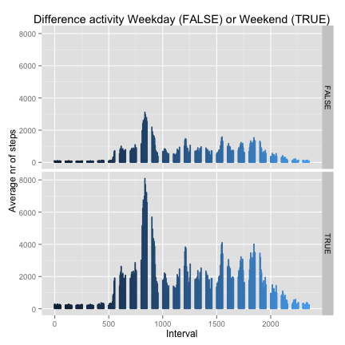

# Reproducible Research: Peer Assessment 1

## Loading and preprocessing the data
The dataset is stored in a zip file (activity.zip) containing a comma-separated-value (activity.csv) file and there are a total of 17,568 observations in this dataset.

The variables included in this dataset are:

* steps: Number of steps taking in a 5-minute interval (missing values are coded as NA)
* date: The date on which the measurement was taken in YYYY-MM-DD format
* interval: Identifier for the 5-minute interval in which measurement was taken


```r
setwd("~/Dropbox/Private/Coursera/Reproducable/RepData_PeerAssessment1")
if(! file.exists("activity.zip")) {
    stop("Please checkout: https://github.com/scottschreckengaust/RepData_PeerAssessment1")
}
library(data.table)
library(xtable)
activity <- read.table(unzip("activity.zip"), header=TRUE, sep=",", stringsAsFactor=FALSE)
str(activity)
```

```
## 'data.frame':	17568 obs. of  3 variables:
##  $ steps   : int  NA NA NA NA NA NA NA NA NA NA ...
##  $ date    : chr  "2012-10-01" "2012-10-01" "2012-10-01" "2012-10-01" ...
##  $ interval: int  0 5 10 15 20 25 30 35 40 45 ...
```

```r
xsummary <- xtable(summary(activity))
```


```r
print(xsummary, type="html")
```

<!-- html table generated in R 3.1.0 by xtable 1.7-3 package -->
<!-- Sun Jul 20 12:08:41 2014 -->
<TABLE border=1>
<TR> <TH>  </TH> <TH>     steps </TH> <TH>     date </TH> <TH>    interval </TH>  </TR>
  <TR> <TD align="right"> 1 </TD> <TD> Min.   :  0.0   </TD> <TD> Length:17568       </TD> <TD> Min.   :   0   </TD> </TR>
  <TR> <TD align="right"> 2 </TD> <TD> 1st Qu.:  0.0   </TD> <TD> Class :character   </TD> <TD> 1st Qu.: 589   </TD> </TR>
  <TR> <TD align="right"> 3 </TD> <TD> Median :  0.0   </TD> <TD> Mode  :character   </TD> <TD> Median :1178   </TD> </TR>
  <TR> <TD align="right"> 4 </TD> <TD> Mean   : 37.4   </TD> <TD>  </TD> <TD> Mean   :1178   </TD> </TR>
  <TR> <TD align="right"> 5 </TD> <TD> 3rd Qu.: 12.0   </TD> <TD>  </TD> <TD> 3rd Qu.:1766   </TD> </TR>
  <TR> <TD align="right"> 6 </TD> <TD> Max.   :806.0   </TD> <TD>  </TD> <TD> Max.   :2355   </TD> </TR>
  <TR> <TD align="right"> 7 </TD> <TD> NA's   :2304   </TD> <TD>  </TD> <TD>  </TD> </TR>
   </TABLE>


```r
## convert interval to a factor
## activity$interval <- as.factor(activity$interval)
## convert date string to a Date
activity$date <- as.Date(activity$date, format="%Y-%m-%d")
```

## What is mean total number of steps taken per day?

```r
# Remove NAs.
activity.nona <- subset(activity,!is.na(steps)) 

# Put into a data table.
activity.nona <- data.table(activity.nona) 

# Add up the steps for each date.
activity.countofstepsperday <- activity.nona[,list(sum=sum(steps)),by=date]
```

1. Make a histogram of the total number of steps taken each day
2. Calculate and report the mean and median total number of steps taken per day

```r
# Calculate the mean of the steps taken.
mean.of.steps.taken = mean(activity.countofstepsperday$sum) ## calculate mean from sums
mean.of.steps.taken
```

```
## [1] 10766
```

```r
# Calculate the median of the steps taken.
median.of.steps.taken = median(activity.countofstepsperday$sum) ## calculate median from sums
median.of.steps.taken
```

```
## [1] 10765
```


```r
library(ggplot2)
g <- ggplot(activity.countofstepsperday, aes(date, sum)) 
## It appears mean and median values are very close
mean.steps <- data.frame(yintercept=mean.of.steps.taken, mean=factor(mean.of.steps.taken))
median.steps <- data.frame(yintercept=median.of.steps.taken, median=factor(median.of.steps.taken))

g + geom_histogram(stat="identity", y=sum, aes(fill=sum)) + xlab("Date") + 
    ylab("Number of Steps") + theme(legend.position = "right", 
    legend.title = element_text(), axis.text.x = element_text(angle=90))
```

 


## What is the average daily activity pattern?

1. Make a time series plot (i.e. type = "l") of the 5-minute interval (x-axis) and the average number of steps taken, averaged across all days (y-axis)


2. Which 5-minute interval, on average across all the days in the dataset, contains the maximum number of steps?


```r
activity.no.na <- subset(activity,!is.na(steps)) ## do not include NA
activity.no.na <- data.table(activity.no.na) ## enable data table subsetting
activity.no.na <- activity.no.na[,list(average=mean(steps)),by=interval]
str(activity.no.na)
```

```
## Classes 'data.table' and 'data.frame':	288 obs. of  2 variables:
##  $ interval: int  0 5 10 15 20 25 30 35 40 45 ...
##  $ average : num  1.717 0.3396 0.1321 0.1509 0.0755 ...
##  - attr(*, ".internal.selfref")=<externalptr>
```

```r
g2 <- ggplot(activity.no.na, aes(interval, average, colour=interval) ) +
      geom_bar(stat="identity") +
      xlab("Interval") +
      ylab("Average number of steps")  +
      theme(legend.position = "none")
g2
```

 

calculate the interval that contains on average the maximum number of steps.


```r
maxavg <- activity.no.na$interval[[which.max(activity.no.na$average)]]
g2 + geom_vline(xintercept=maxavg, colour="yellow", linetype = "longdash")
```

 


```r
## printing exact interval
maxavg
```

```
## [1] 835
```
## Imputing missing values
Note that there are a number of days/intervals where there are missing values (coded as NA). The presence of missing days may introduce bias into some calculations or summaries of the data.

1.Calculate and report the total number of missing values in the dataset (i.e. the total number of rows with NAs)

```r
narows <- nrow(activity) - nrow(activity.no.na)
narows
```

```
## [1] 17280
```

2.Devise a strategy for filling in all of the missing values in the dataset. The strategy does not need to be sophisticated. For example, you could use the mean/median for that day, or the mean for that 5-minute interval, etc.


```r
activity.imputed <- activity
impute <- function (df) {
  for (i in 1:nrow(df)) {
  if (is.na(df$steps[i])) 
    df$steps[i] <- mean(df$steps,na.rm=TRUE)
  }
  df
}
```

3.Create a new dataset that is equal to the original dataset but with the missing data filled in.

```r
activity.imputed.org <- impute(activity.imputed)
summary(activity.imputed)
```

```
##      steps            date               interval   
##  Min.   :  0.0   Min.   :2012-10-01   Min.   :   0  
##  1st Qu.:  0.0   1st Qu.:2012-10-16   1st Qu.: 589  
##  Median :  0.0   Median :2012-10-31   Median :1178  
##  Mean   : 37.4   Mean   :2012-10-31   Mean   :1178  
##  3rd Qu.: 12.0   3rd Qu.:2012-11-15   3rd Qu.:1766  
##  Max.   :806.0   Max.   :2012-11-30   Max.   :2355  
##  NA's   :2304
```

4.Make a histogram of the total number of steps taken each day and Calculate and report the mean and median total number of steps taken per day. Do these values differ from the estimates from the first part of the assignment? What is the impact of imputing missing data on the estimates of the total daily number of steps?


```r
activity.imputed <- data.table(activity.imputed.org)
activity.imputed <- activity.imputed[,list(average=mean(steps)),by=interval]
str(activity.imputed)
```

```
## Classes 'data.table' and 'data.frame':	288 obs. of  2 variables:
##  $ interval: int  0 5 10 15 20 25 30 35 40 45 ...
##  $ average : num  6.39 5.2 5.02 5.03 4.97 ...
##  - attr(*, ".internal.selfref")=<externalptr>
```

```r
g2 <- ggplot(activity.imputed, aes(interval, average, colour=interval) ) +
      geom_bar(stat="identity") +
      xlab("Interval") +
      ylab("Average nr of steps")  +
      theme(legend.position = "none")
g2
```

 


```r
maxavg2 <- activity.imputed$interval[[which.max(activity.imputed$average)]]
g2 + geom_vline(xintercept=maxavg2, colour="yellow", linetype = "longdash")
```

 

Printing the maximum average on steps

```r
maxavg2
```

```
## [1] 835
```

## Are there differences in activity patterns between weekdays and weekends?

```r
activity.imputed <- data.table(activity.imputed.org)
activity.imputed$weekday <- !(as.POSIXlt(activity.imputed$date)$wd %in% c(0,1))
activity.imputed$average <- activity.imputed[,list(average=mean(steps)),by=interval]$average
g3 <- ggplot(activity.imputed, aes(x=interval, y=average, group=weekday, colour=interval) ) +
      geom_bar(stat="identity") +
      xlab("Interval") +
      ylab("Average nr of steps")  +
      ## TODO change facet labels
      labs(title = "Difference activity Weekday (FALSE) or Weekend (TRUE)") +
      theme(legend.position = "none") +
      facet_grid(weekday ~ .)
g3
```

 

# ``` {r, echo=FALSE, results='hide'}
# library(knitr)
# knit2html("PA1_template.Rmd”)
# browseURL("PA1_template.html”)
# ```

A first glance at the data shows that there is more activity in the weekend days.

