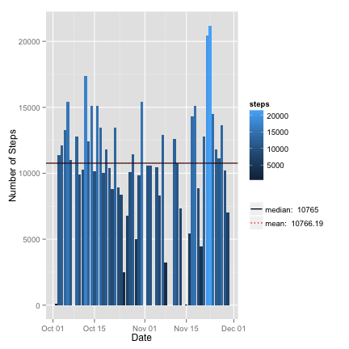
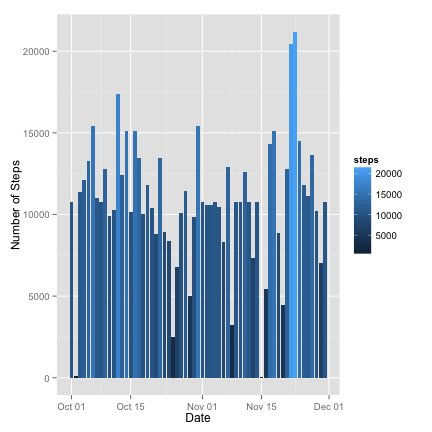

# Reproducible Research: Peer Assessment 1

## Loading and preprocessing the data
The dataset is stored in a zip file (activity.zip) containing a comma-separated-value (activity.csv) file and there are a total of 17,568 observations in this dataset.

The variables included in this dataset are:

* steps: Number of steps taking in a 5-minute interval 
(missing values are coded as NA)
* date: The date on which the measurement was taken in YYYY-MM-DD format
* interval: Identifier for the 5-minute interval in which measurement was taken.


```r
setwd("~/Dropbox/Private/Coursera/Reproducable/RepData_PeerAssessment1")
if(! file.exists("activity.zip")) {
    stop("Please checkout: https://github.com/scottschreckengaust/RepData_PeerAssessment1")
}
library(data.table)
library(xtable)
activity <- read.table(unzip("activity.zip"), header=TRUE, sep=",", stringsAsFactor=FALSE)
str(activity)
```

```
## 'data.frame':	17568 obs. of  3 variables:
##  $ steps   : int  NA NA NA NA NA NA NA NA NA NA ...
##  $ date    : chr  "2012-10-01" "2012-10-01" "2012-10-01" "2012-10-01" ...
##  $ interval: int  0 5 10 15 20 25 30 35 40 45 ...
```

```r
xsummary <- xtable(summary(activity))
```


```r
print(xsummary, type="html")
```

<!-- html table generated in R 3.1.0 by xtable 1.7-3 package -->
<!-- Sun Jul 20 16:15:28 2014 -->
<TABLE border=1>
<TR> <TH>  </TH> <TH>     steps </TH> <TH>     date </TH> <TH>    interval </TH>  </TR>
  <TR> <TD align="right"> 1 </TD> <TD> Min.   :  0.0   </TD> <TD> Length:17568       </TD> <TD> Min.   :   0   </TD> </TR>
  <TR> <TD align="right"> 2 </TD> <TD> 1st Qu.:  0.0   </TD> <TD> Class :character   </TD> <TD> 1st Qu.: 589   </TD> </TR>
  <TR> <TD align="right"> 3 </TD> <TD> Median :  0.0   </TD> <TD> Mode  :character   </TD> <TD> Median :1178   </TD> </TR>
  <TR> <TD align="right"> 4 </TD> <TD> Mean   : 37.4   </TD> <TD>  </TD> <TD> Mean   :1178   </TD> </TR>
  <TR> <TD align="right"> 5 </TD> <TD> 3rd Qu.: 12.0   </TD> <TD>  </TD> <TD> 3rd Qu.:1766   </TD> </TR>
  <TR> <TD align="right"> 6 </TD> <TD> Max.   :806.0   </TD> <TD>  </TD> <TD> Max.   :2355   </TD> </TR>
  <TR> <TD align="right"> 7 </TD> <TD> NA's   :2304   </TD> <TD>  </TD> <TD>  </TD> </TR>
   </TABLE>


```r
## Convert the date string to a date.
activity$date <- as.Date(activity$date, format="%Y-%m-%d")
```

## What is mean total number of steps taken per day?
*For this part of the assignment, you can ignore the missing values in the dataset.*

```r
# Remove NAs.
activity.nona <- subset(activity,!is.na(steps)) 

# Put into a data table.
activity.nonatable <- data.table(activity.nona) 

# Add up the steps for each date.
activity.nonacountofstepsperday <- activity.nonatable[,list(sum=sum(steps)),by=date]
```

1. Make a histogram of the total number of steps taken each day


```r
library(ggplot2)
g1 <- ggplot(activity.nonacountofstepsperday, aes(date, sum)) 
g1 <- g1 + 
    geom_histogram(stat="identity", y=sum, aes(fill=sum)) + 
    xlab("Date") + 
    ylab("Number of Steps") + 
    scale_fill_continuous(name="steps")
g1
```

 

2. Calculate and report the mean and median total number of steps taken per day

```r
# Calculate the mean of the steps taken.
activity.nonameanofstepstakenperday = mean(activity.nonacountofstepsperday$sum)
activity.nonameanofstepstakenperday
```

```
## [1] 10766
```

```r
# Calculate the median of the steps taken.
activity.nonamedianofstepstakenperday = median(activity.nonacountofstepsperday$sum)
activity.nonamedianofstepstakenperday
```

```
## [1] 10765
```


```r
activity.nonamedianofstepstakenperdayframe = data.frame(
    yintercept=activity.nonamedianofstepstakenperday,
    median=factor(activity.nonamedianofstepstakenperday))

gnonamedian <- geom_hline(aes(yintercept=yintercept, linetype=median), 
    data=activity.nonamedianofstepstakenperdayframe, 
    colour="black",
    show_guide=TRUE)

activity.nonameanofstepstakenperdayframe = data.frame(
    yintercept=activity.nonameanofstepstakenperday,
    mean=factor(activity.nonameanofstepstakenperday))

gnonamean <- geom_hline(aes(yintercept=yintercept, linetype=mean),
    data=activity.nonameanofstepstakenperdayframe,
    colour="red",
    show_guide=TRUE)

g1 + gnonamedian + gnonamean + 
    scale_linetype_manual(name="", 
    values=c(1,3), 
    labels=c(
        paste("median: ", activity.nonamedianofstepstakenperday), 
        paste("mean: ", round(activity.nonameanofstepstakenperday, 2))
    )
    ) + guides(linetype=guide_legend(override.aes=list(colour = c("black","red"))))
```

 


## What is the average daily activity pattern?

1. Make a time series plot (i.e. type = "l") of the 5-minute interval (x-axis) 
and the average number of steps taken, averaged across all days (y-axis)


```r
activity.nonaaveragestepperinterval <- activity.nonatable[,list(average=mean(steps)),by=interval]

g2 <- ggplot(activity.nonaaveragestepperinterval, aes(interval, average, colour=average) ) +
      geom_bar(stat="identity") +
      xlab("Interval") +
      ylab("Average number of steps") +
      theme(legend.position = "none")
g2
```

 

2. Which 5-minute interval, on average across all the days in the dataset, 
contains the maximum number of steps?


```r
## Calculate the interval that contains on average the maximum number of steps.
activity.maxavg <- activity.nonaaveragestepperinterval$interval[[which.max(activity.nonaaveragestepperinterval$average)]]
g2 + geom_vline(xintercept=activity.maxavg, colour="red", linetype = "longdash")
```

 


```r
## printing exact interval
activity.maxavg
```

```
## [1] 835
```
## Imputing missing values
Note that there are a number of days/intervals where there are missing values (coded as NA). The presence of missing days may introduce bias into some calculations or summaries of the data.

1.Calculate and report the total number of missing values in the dataset (i.e. the total number of rows with NAs)

```r
narows <- nrow(activity) - nrow(activity.nona)
narows
```

```
## [1] 2304
```

2.Devise a strategy for filling in all of the missing values in the dataset. The strategy does not need to be sophisticated. For example, you could use the mean/median for that day, or the mean for that 5-minute interval, etc.


```r
activity.imputed <- activity
impute <- function (df) {
  for (i in 1:nrow(df)) {
  if (is.na(df$steps[i])) 
    df$steps[i] <- mean(df$steps,na.rm=TRUE)
  }
  df
}
```

3.Create a new dataset that is equal to the original dataset but with the missing data filled in.

```r
activity.imputeddata <- impute(activity.imputed)
summary(activity.imputeddata)
```

```
##      steps            date               interval   
##  Min.   :  0.0   Min.   :2012-10-01   Min.   :   0  
##  1st Qu.:  0.0   1st Qu.:2012-10-16   1st Qu.: 589  
##  Median :  0.0   Median :2012-10-31   Median :1178  
##  Mean   : 37.4   Mean   :2012-10-31   Mean   :1178  
##  3rd Qu.: 37.4   3rd Qu.:2012-11-15   3rd Qu.:1766  
##  Max.   :806.0   Max.   :2012-11-30   Max.   :2355
```

```r
activity.imputedframe <- data.table(activity.imputeddata)
activity.imputedframebydate <- activity.imputedframe[,list(sum=sum(steps)),by=date]
activity.imputedframebyinterval <- activity.imputedframe[,list(average=mean(steps)),by=interval]
```

4. Make a histogram of the total number of steps taken each day,  

```r
g3 <- ggplot(activity.imputedframebydate, aes(date, sum)) 
g3 <- g3 + 
    geom_histogram(stat="identity", y=sum, aes(fill=sum)) + 
    xlab("Date") + 
    ylab("Number of Steps") + 
    scale_fill_continuous(name="steps")
g3
```

 

Calculate and report the mean and median total number of steps taken per day.  


```r
activity.imputedmeanofstepstakenperday = mean(activity.imputedframebydate$sum)
activity.imputedmeanofstepstakenperday
```

```
## [1] 10766
```

```r
activity.imputedmedianofstepstakenperday = median(activity.imputedframebydate$sum)
activity.imputedmedianofstepstakenperday
```

```
## [1] 10766
```

```r
activity.maxavg2 <- activity.imputedframebyinterval$interval[[which.max(activity.imputedframebyinterval$average)]]
```

Do these values differ from the estimates from the first part of the assignment?  
activity.

```r
# Difference in mean without NAs and mean with imputed NAs filled by mean.
activity.nonameanofstepstakenperday - activity.imputedmeanofstepstakenperday
```

```
## [1] 0
```

```r
# Difference in median without NAs and median with imputed NAs filled by mean.
activity.nonamedianofstepstakenperday - activity.imputedmedianofstepstakenperday
```

```
## [1] -1.189
```

```r
# Difference in the interval
activity.maxavg - activity.maxavg2
```

```
## [1] 0
```
What is the impact of imputing missing data on the estimates of the total daily number of steps?  

**No significant impact, as the mean and maximum average intervals have not
changed, and the change in the median for the steps taken is relatively small.** 


```r
g4 <- ggplot(activity.imputedframebyinterval, aes(interval, average, colour=average) ) +
      geom_bar(stat="identity") +
      xlab("Interval") +
      ylab("Average number of steps") +
      theme(legend.position = "none")
g4 + geom_vline(xintercept=activity.maxavg2, colour="red", linetype = "longdash")
```

 

Printing the maximum average on steps

```r
activity.maxavg2
```

```
## [1] 835
```

## Are there differences in activity patterns between weekdays and weekends?

```r
activity.imputedframe$weekday <- !(as.POSIXlt(activity.imputedframe$date)$wd %in% c(0,6))
activity.imputedframe$average <- activity.imputedframe[,list(average=mean(steps)),
    by=interval]$average
g5 <- ggplot(activity.imputedframe, aes(x=interval, y=average)) +
      geom_line() +
      xlab("5 minute interval") +
      ylab("Average Number of Steps")  +
      labs(title = "Activity for Weekday (FALSE) verse Weekend (TRUE)") +
      theme(legend.position = "none") +
      facet_grid(weekday ~ .)
g5
```

 

**There is no disquishing of the weekend verse weekday pattern over the
daily 24-hour interval steps.**
